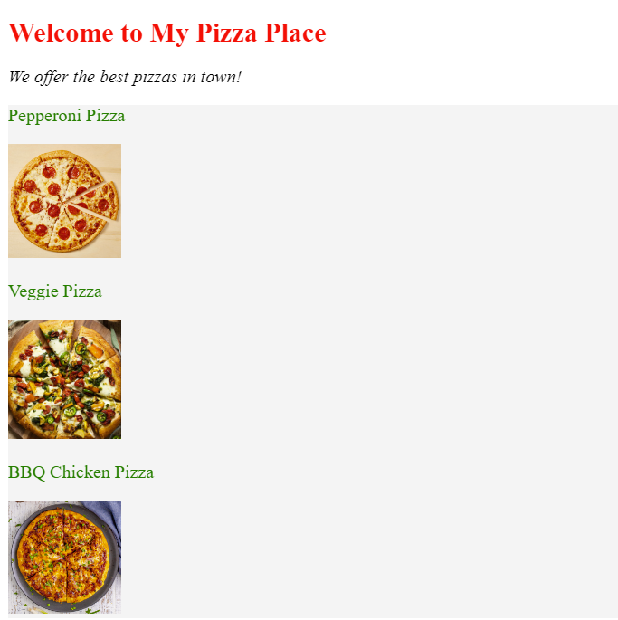

# Pizza Website CSS Makeover

We got a **pizza website** that needs a CSS makeover! Follow these instructions to style it up.

### Tasks:

1. Make the main title's text **red**, with font size **24px**!
2. Change the description's font style to **italic**!
3. Change the pizza list's background color to **grey**!
4. Change each pizza's text color to **green**!
5. Make the width of all the pizza images **100px**!

